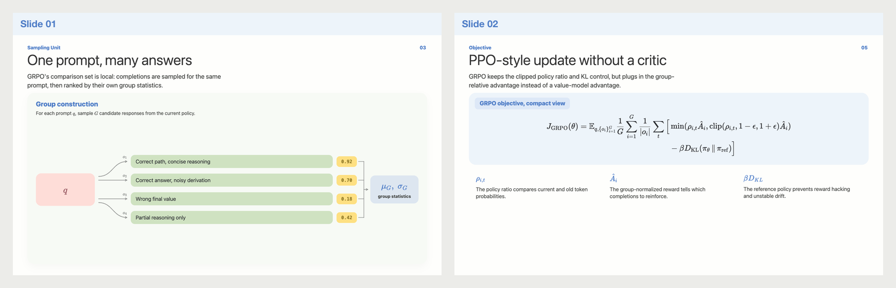
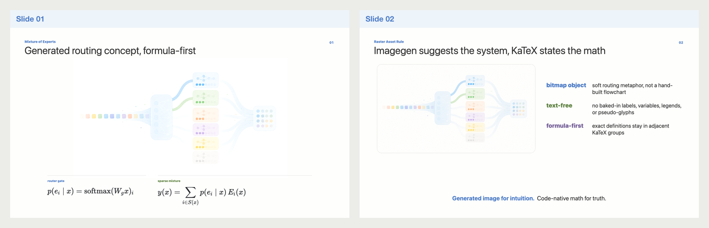
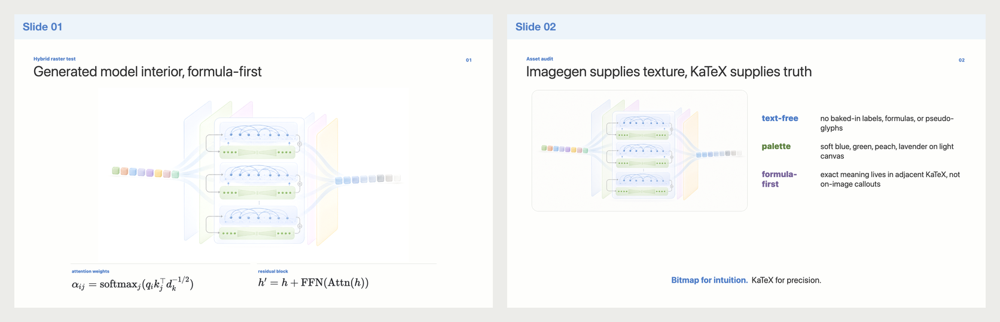

# NicePre

English | [简体中文](README.zh-CN.md)

NicePre is a Codex skill plus a small set of examples for building polished,
light academic presentation slides with HTML/CSS/SVG, KaTeX, semantic color,
automatic diagram layout, and rendered visual QA.

## Skill

The reusable skill lives at:

- [`skills/academic-slide-deck/SKILL.md`](skills/academic-slide-deck/SKILL.md)

It includes references for:

- visual palette and typography
- formula-heavy slide layout
- connector and arrow rules
- token, embedding, and model block diagrams
- screenshot/contact-sheet QA

## Showcase Gallery

The repository keeps a small gallery of rendered PNGs so the style can be
judged directly on GitHub before running any setup.

### GRPO Showcase

Source: [`examples/grpo-showcase`](examples/grpo-showcase)

<a href="examples/grpo-showcase/export/contact-sheet.png">
  
</a>

### MDP Polished Reproduction

Source: [`examples/mdp-reproduction`](examples/mdp-reproduction)

<a href="examples/mdp-reproduction/export/slide-01.png">
  
</a>

### MoE Raster Concept

Source: [`examples/moe-router`](examples/moe-router)

<a href="examples/moe-router/export/contact-sheet.png">
  
</a>

### Hybrid Raster + KaTeX

Source: [`examples/hybrid-transformer`](examples/hybrid-transformer)

<a href="examples/hybrid-transformer/export/contact-sheet.png">
  
</a>

Open the HTML files directly after installing development dependencies, or run
the render script to regenerate PNGs and contact sheets.

## Using With Codex

If you are using this as a Codex skill, you do not need to manually prepare this
repository before every task. Ask your agent to install or use the skill from
this repository:

```text
Install and use the academic-slide-deck skill from
https://github.com/bitkira/NicePre/tree/main/skills/academic-slide-deck
```

Then let the agent configure the target workspace as needed.

Dependency setup is agent-managed. Users do not need this repository's
`node_modules`, and they do not need to run `npm install` here just to use the
skill. When a deck needs to be rendered, the agent should configure the active
target workspace: use an existing `package.json` when appropriate, create a
minimal one when needed, install KaTeX and Playwright there, and use an
available browser or install a Playwright browser.

This repository's `package.json` is for developing NicePre itself and
regenerating the included examples. The checked-in PNG previews can be viewed
on GitHub without running any setup.

## Local Development Setup

Use this section only when you want to run the examples or renderer yourself
from a local clone. It is not required for installing or using the skill through
Codex.

```bash
npm install
```

KaTeX is required for local formula rendering. The render script also uses
Playwright and optionally Sharp. On macOS it will use Google Chrome when
available; otherwise install a Playwright browser with `npx playwright install
chromium`, or pass `--chrome-executable`.

```bash
npm install --save-dev playwright sharp
```

## Render

```bash
npm run render:grpo
npm run render:mdp
npm run render:moe
npm run render:hybrid
npm run render:all
```

The shared renderer can be used directly:

```bash
node skills/academic-slide-deck/scripts/render-deck.mjs \
  examples/grpo-showcase/index.html \
  --out examples/grpo-showcase/export \
  --slides .slide \
  --width 1600 \
  --height 900 \
  --ready body.math-ready
```

It writes slide PNGs, `contact-sheet.html`, optional `contact-sheet.png`, and
`render-report.json`.

## Acknowledgements

NicePre was inspired in part by Bilibili creator
[吃花椒的麦](https://www.bilibili.com/video/BV1rooaYVEk8/). Special thanks for
the visual presentation ideas and academic-slide craft reflected in that work.

## License

Apache-2.0. The small Noto Emoji SVG subset in
`examples/mdp-reproduction/assets/noto-emoji/` keeps its upstream notices.
